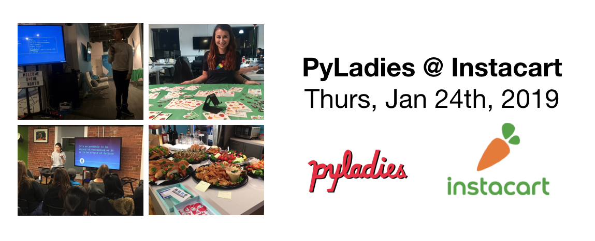

.. _talks_workshops:

Past Talks and Workshops
========================

A list of past PyLadies Toronto talks and workshops.

We are always looking for speakers. Please fill in this `form <https://goo.gl/forms/sloM5ZZeEsZX19133>`_ to give a talk or 
this `form <https://goo.gl/forms/3lJOV85rYwpRf9iG3>`_ to run a workshop. We'll back to you as soon as possible!

You can also `suggest a talk or workshop topic <https://goo.gl/forms/nGSj8jZpkMsF6Ck43>`_.

January 24th, 2019
-------------------

Our PyLadies 2019 kick-off was held at `Instacart's <https://www.instacart.com/>`_ Toronto office and was a great success!

The line-up:
~~~~~~~~~~~~

- **Migrating from Python 2 to Python 3: Lessons Learnt and Pitfalls Navigated.** Presented by Kristen and Mariam.
- **Empowering Patients through Machine Learning Driven Personalized Digital Health Interventions.** Presented by Mareena. See slides `here. <https://speakerdeck.com/pyladiesto/empowering-patients-through-machine-learning-driven-health-interventions>`_
- **A Background Erasor Tool in Python.** Presented by Deepika. See slides `here. <https://speakerdeck.com/pyladiesto/a-background-eraser-tool-in-python>`_
- **Know Your Editor and Tools.** Presented by Anna.

